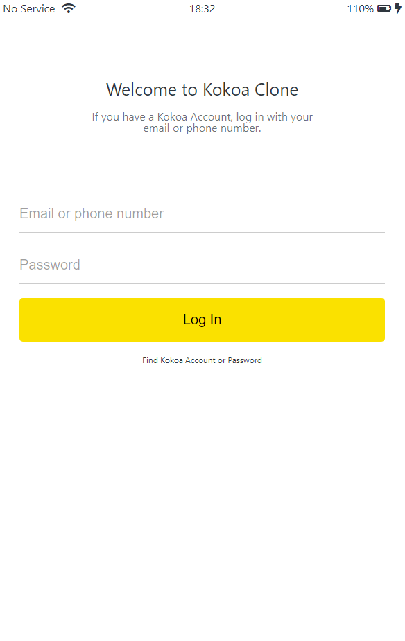
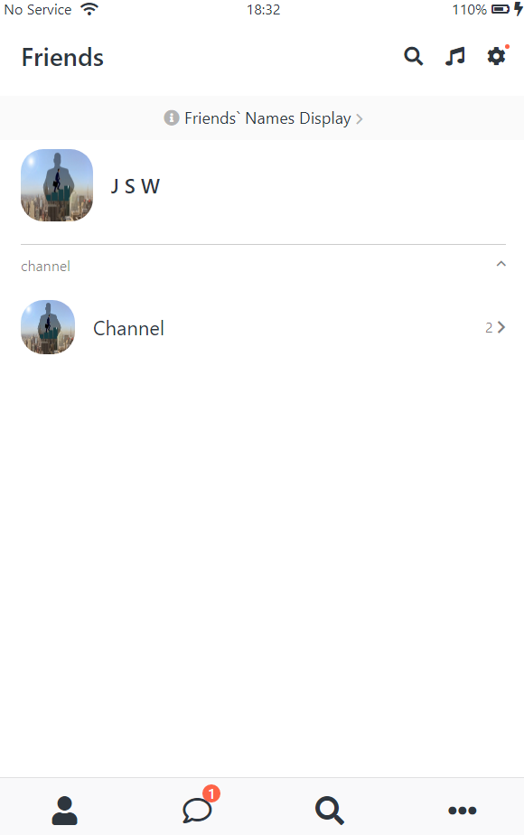
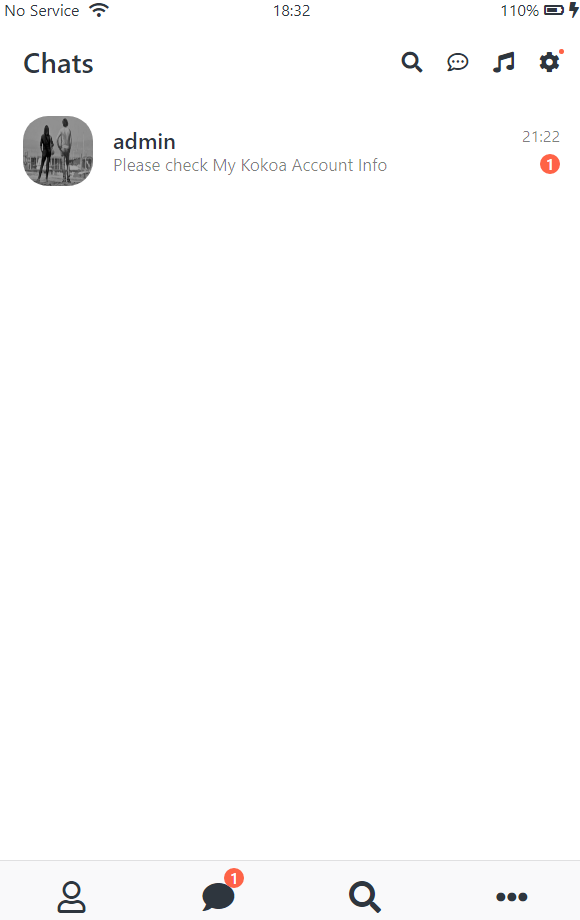
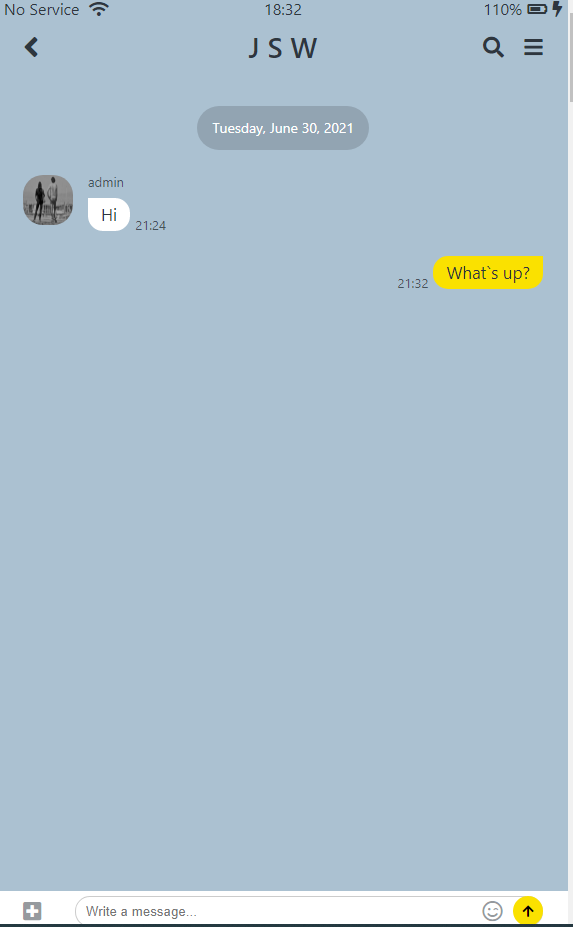
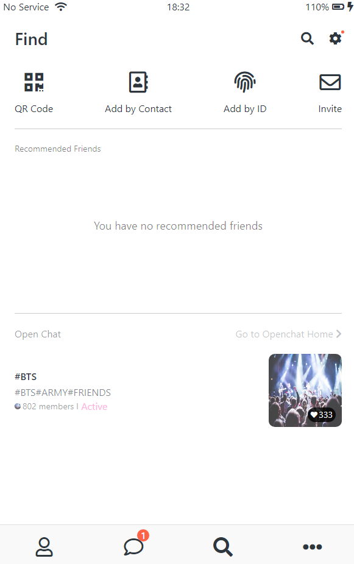
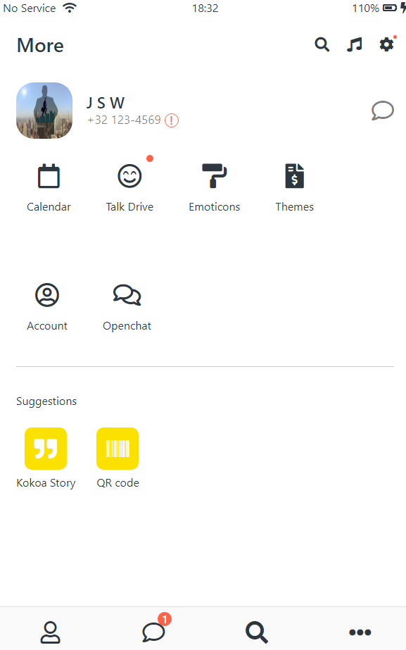
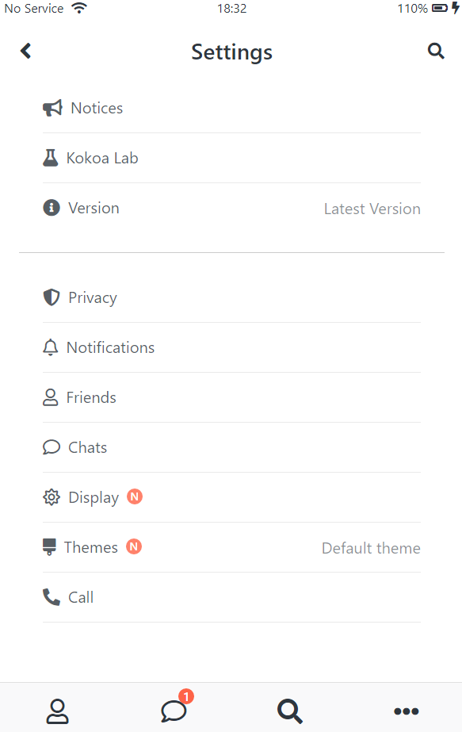
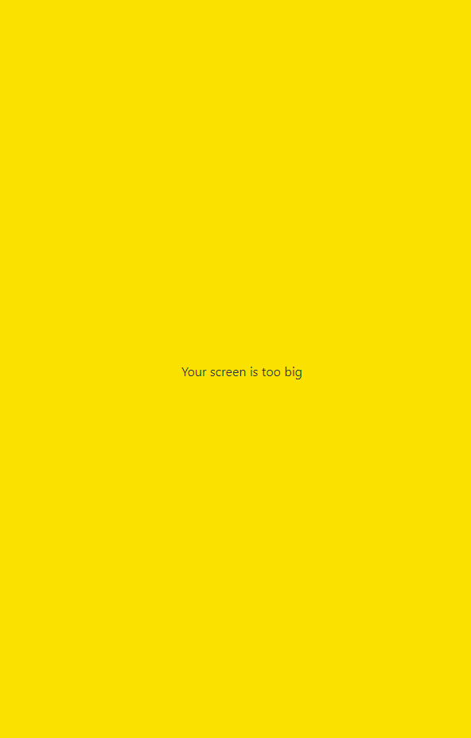

# Kokoa Clone 2021 with nomadcoder

- 목표: Make website Using HTML & CSS
- Link: [KokoaTalk-Clone](https://software92.github.io/kokoa-clone-2021/)

#### Pages Screenshot

  
  
  
  
  
  
  
  
